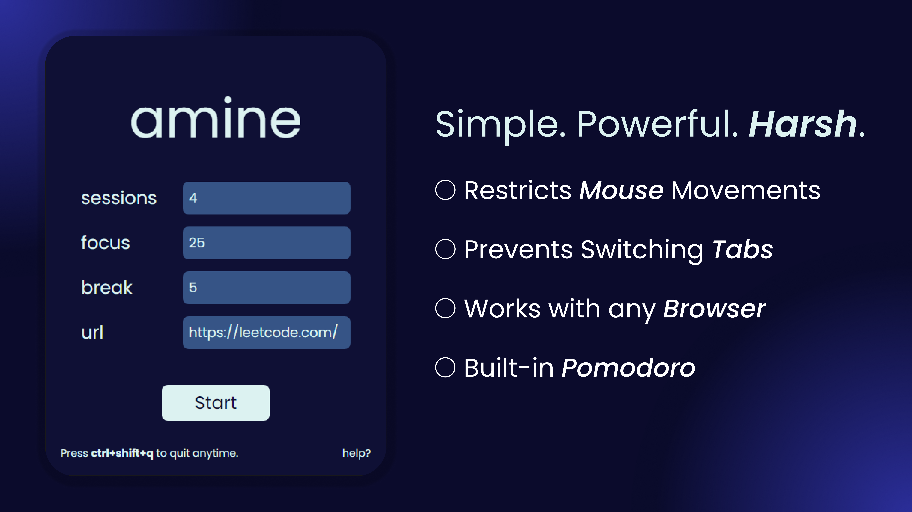

<div align="center">

# amine



</div>

## Features

- **Customizable Pomodoro Sessions**: Set the number of sessions, focus duration, and break duration.
- **Strict Distraction Blocking**: 
  - Blocks key combinations that might disrupt focus (e.g., Windows key, Alt+Tab).
  - Prevents mouse movement to screen edges.
- **Fullscreen Enforcement**: Automatically enters fullscreen mode for the chosen focus website.
- **Safe Exit Mechanism**: Allows users to exit using a predefined key combination (Ctrl+Shift+Q).
- **User-Friendly Interface**: Clean, responsive design built with HTML, Tailwind CSS, and custom fonts.

## Comparison

| Feature | amine | Freedom | RescueTime | Cold Turkey | Standard Pomodoro Timers |
|---------|-------|---------|------------|-------------|--------------------------|
| Website Blocking | ✅ | ✅ | ✅ | ✅ | ❌ |
| Fullscreen Enforcement | ✅ | ❌ | ❌ | ❌ | ❌ |
| Key Combination Blocking | ✅ | ❌ | ❌ | ✅ | ❌ |
| Mouse Movement Restriction | ✅ | ❌ | ❌ | ❌ | ❌ |
| Customizable Sessions | ✅ | ✅ | ✅ | ✅ | ✅ |
| Local Application (No Account Needed) | ✅ | ❌ | ❌ | ✅ | Varies |

## Technical Stack

- **Backend**: Python with Flask
- **Frontend**: HTML, JavaScript, Tailwind CSS
- **GUI**: FlaskWebGUI
- **Dependency Management**: Poetry
- **Additional Libraries**: pyautogui, keyboard, pygetwindow, winsound

## Technical Insights

1. **Multithreading**: The application uses Python's threading module to run the Pomodoro timer and mouse boundary enforcement concurrently with the main Flask application.

2. **Low-Level Input Blocking**: Utilizes the `keyboard` library to block specific key combinations at a system level, providing robust protection against common distraction patterns.

3. **Window Management**: Employs `pygetwindow` to manipulate application windows, ensuring the focus stays on the target website.

4. **Custom GUI with Flask**: Leverages FlaskWebGUI to create a desktop application experience using web technologies, allowing for a responsive and easily customizable interface.

5. **Tailwind CSS Integration**: Uses Tailwind CSS via CDN for rapid UI development and consistent styling across the application.

## Setup and Installation

1. Clone the repository:
   ```
   git clone https://github.com/datavorous/amine.git
   cd amine
   ```

2. Install Poetry (if not already installed):
   ```
   pip install poetry
   ```

3. Install dependencies using Poetry:
   ```
   poetry install
   ```

4. Run the application:
   ```
   cd amine
   poetry run python webapp.py
   ```

## Usage

1. Launch the application.
2. On the main page, set your desired Pomodoro parameters:
   - Number of sessions
   - Focus duration (in minutes)
   - Break duration (in minutes)
   - Website URL for focusing
3. Click "Start" to begin your Pomodoro session.
4. The application will open your chosen website in fullscreen mode and start the timer.
5. To exit at any time, use the key combination Ctrl+Shift+Q.

## Important Notes

- Avoid manually exiting fullscreen mode or moving your mouse to screen edges during a session.
- The application may perform an initial page click to ensure fullscreen mode, which could cause minor disruptions.

## Contributing

Contributions to amine are welcome. Please feel free to submit a Pull Request.

## Support

For support, please email [bhattacharjeesagnik910@gmail.com](mailto:bhattacharjeesagnik910@gmail.com).

## License

[MIT License](LICENSE)
